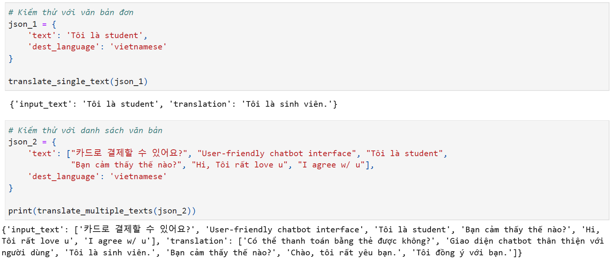
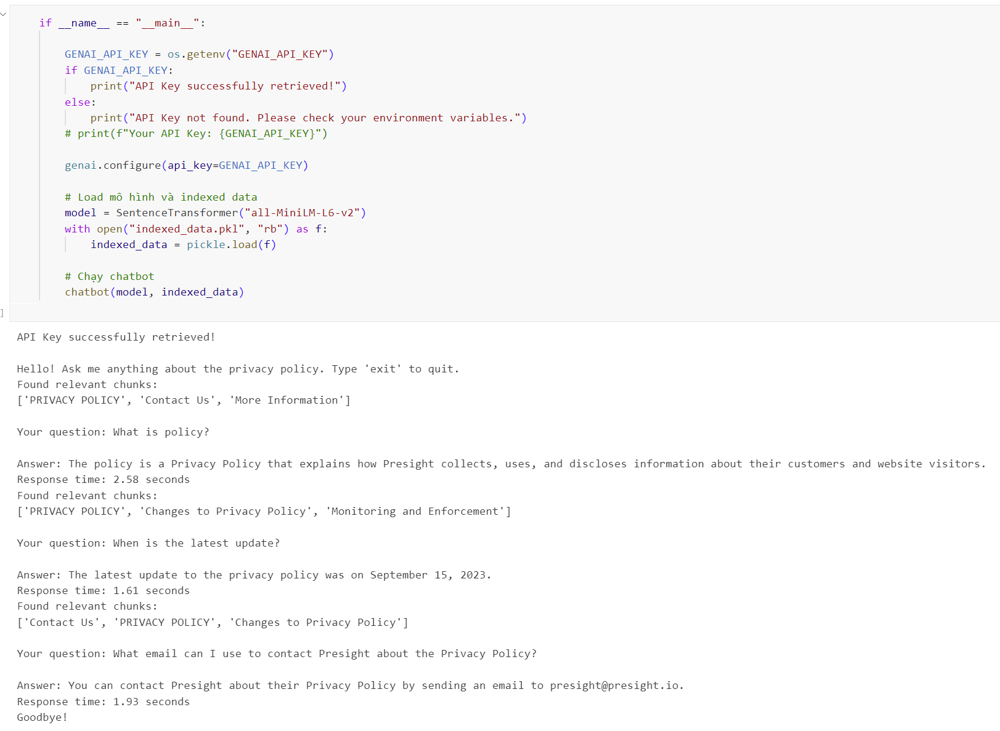

# **LLM-TRANSLATION-AND-CHATBOT**

## **Description**
A project integrating Gemini API for building AI-powered tools, including a text translation module (single and multiple texts) and a chatbot that processes website data for intelligent query responses.

### **Part 1: Language Translation**

- This module leverages the Gemini API to accurately translate text into Vietnamese.

- It supports both single text translation and batch processing for multiple inputs.

- To optimize performance, the system first detects the input language—if it is already in Vietnamese, the text remains unchanged.

### **Part 2: AI-Powered Chatbot**

The chatbot is designed to gather information from a specific website, process and index the data for efficient search, and generate accurate responses based on the retrieved content. It leverages NLP to identify the most relevant information and integrates it with an LLM to provide precise and contextually rich answers.

Here is the link to the website: [Presight Privacy Policy](https://www.presight.io/privacy-policy.html)

## **Results**

**Part 1: Language Translation**

- Translates both single and multiple texts into Vietnamese.  

- Detects the input language and leaves Vietnamese texts unchanged.

    **Example:**

    - Input: "Hello" 
    → Output: "Xin chào"

    - Input: ["Hello", "How are you?", "Tôi là sinh viên"] 
    → Output: ["Xin chào", "Bạn khỏe không?", "Tôi là sinh viên"]

    

**Part 2: AI-Powered Chatbot**

- Collects data from [Presight Privacy Policy](https://www.presight.io/privacy-policy.html), processes it, and creates a search index.

- Uses NLP to find the most relevant passage from the website data and generates answers using LLM.

    **Example:**

    - Question: "What is Presight’s privacy policy?"

    - Chatbot response: "The policy is a Privacy Policy that explains how Presight collects, uses, and discloses information about their customers and website visitors."
    
    

## **Project Structure**
  
| **Folder**              | **Description**                                                   |
|-------------------------|-------------------------------------------------------------------|  
| llm_integration         | Developing an AI for language translation.                        |
| chatbot_development     | Building a chatbot by crawling, preprocessing, and indexing data. |
| chatbot_interface       | Source code to create a user-friendly chatbot interaction UI.     |
| results                 | Stores output images, chatbot demo video, and the consolidated source code. |

## **Contributors**
| **Name**| **Major**| **University**|
|-|-|-|
| Ho Tran Anh Thu       | Data Science  | University of Science (VNUHCM) |
| Nguyen Ngoc Thanh Thu | Data Science  | University of Science (VNUHCM) |
| Phan Binh Phuong      | Data Science  | University of Science (VNUHCM) |
| Huynh Thao Quynh      | Data Science  | University of Science (VNUHCM) |

## **Git Commit Message Rule**
After performing the **`git add .`** command, the **`git commit`** message should follow this structure:

    git commit -m "[folder/file updated] - [task description]"

**Example:**
    
    git commit -m "llm_integration/translation.py - get Gemini API"

Task description should provide enough information for other members to understand what was updated or changed, e.g., fixing bugs, adding features, refactoring code.

After that, use the **`git push`** command to push into the GitHub repository.

